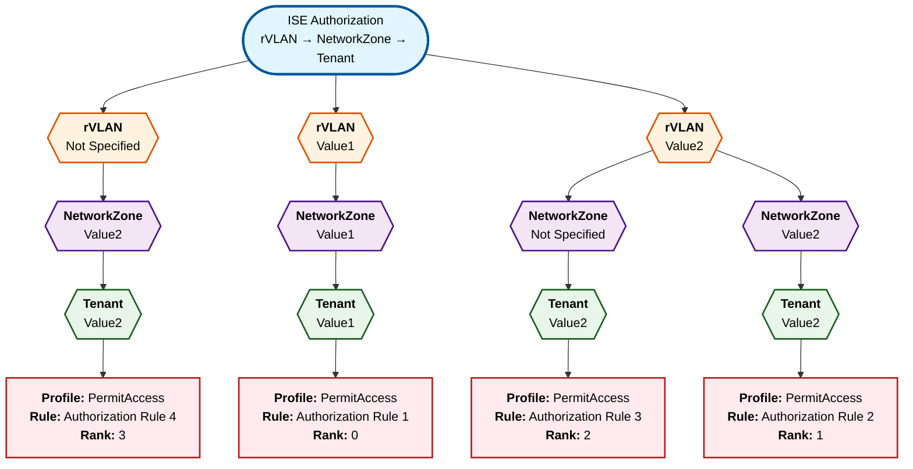

# ISE Authorization Policy Decision Tree Analysis

## Overview
This document provides a comprehensive hierarchical decision tree analysis of the ISE authorization policies configured in the system. The analysis focuses on the evaluation flow: **rVLAN → NetworkZone → Tenant → Authorization Profile**.

---

## Executive Summary

- **Total Authorization Rules**: 15
- **Endpoint Attribute-Based Rules**: 4 (using rVLAN/NetworkZone/Tenant)
- **Other Condition-Based Rules**: 11 (using authentication, posture, identity groups, etc.)
- **Policy Sets**: 3 (PolicySet1, PolicySet2, Default)

---

## Decision Tree Visualization

### Endpoint Attribute-Based Rules (rVLAN → NetworkZone → Tenant)

---

## Detailed Rule Analysis

### Endpoint Attribute-Based Rules

#### Path 1: rVLAN=Value1 → NetworkZone=Value1 → Tenant=Value1
- **Rank 0**: Authorization Rule 1
- **Profile**: PermitAccess
- **Conditions**:
  - EndPoints.rVLAN equals Value1
  - EndPoints.NetworkZone equals Value1
  - EndPoints.Tenant equals Value1

#### Path 2: rVLAN=Value2 → NetworkZone=Value2 → Tenant=Value2
- **Rank 1**: Authorization Rule 2
- **Profile**: PermitAccess
- **Conditions**:
  - EndPoints.rVLAN equals Value2
  - EndPoints.NetworkZone equals Value2
  - EndPoints.Tenant equals Value2

#### Path 3: rVLAN=Value2 → NetworkZone=Not Specified → Tenant=Value2
- **Rank 2**: Authorization Rule 3
- **Profile**: PermitAccess
- **Conditions**:
  - EndPoints.rVLAN equals Value2
  - EndPoints.Tenant equals Value2
  - NetworkZone is not specified (matches any)

#### Path 4: rVLAN=Not Specified → NetworkZone=Value2 → Tenant=Value2
- **Rank 3**: Authorization Rule 4
- **Profile**: PermitAccess
- **Conditions**:
  - EndPoints.NetworkZone equals Value2
  - EndPoints.Tenant equals Value2
  - rVLAN is not specified (matches any)

---

### Other Authorization Rules (Non-Endpoint Attributes)

#### Rank 0: Wireless Block List Default
- **Profile**: Block_Wireless_Access
- **Conditions**:
  - Radius.NAS-Port-Type equals Wireless - IEEE 802.11
  - IdentityGroup.Name equals Endpoint Identity Groups:Blocked List

#### Rank 1: Profiled Cisco IP Phones
- **Profile**: Cisco_IP_Phones
- **Conditions**:
  - IdentityGroup.Name equals Endpoint Identity Groups:Profiled:Cisco-IP-Phone

#### Rank 2: Profiled Non Cisco IP Phones
- **Profile**: Non_Cisco_IP_Phones
- **Conditions**:
  - EndPoints.LogicalProfile equals IP-Phones

#### Rank 3: Unknown_Compliance_Redirect
- **Profile**: Cisco_Temporal_Onboard
- **Conditions**:
  - Network Access.AuthenticationStatus equals AuthenticationPassed
  - Session.PostureStatus equals Unknown

#### Rank 4: NonCompliant_Devices_Redirect
- **Profile**: Cisco_Temporal_Onboard
- **Conditions**:
  - Network Access.AuthenticationStatus equals AuthenticationPassed
  - Session.PostureStatus equals NonCompliant

#### Rank 5: Compliant_Devices_Access
- **Profile**: PermitAccess
- **Conditions**:
  - Network Access.AuthenticationStatus equals AuthenticationPassed
  - Session.PostureStatus equals Compliant

#### Rank 6: Employee_EAP-TLS
- **Profile**: PermitAccess
- **Conditions**:
  - Normalised Radius.RadiusFlowType equals Wireless802_1x
  - EndPoints.BYODRegistration equals Yes
  - Network Access.EapAuthentication equals EAP-TLS
  - CERTIFICATE.Subject Alternative Name equals Calling-Station-ID

#### Rank 7: Employee_Onboarding
- **Profile**: NSP_Onboard
- **Conditions**:
  - Normalised Radius.RadiusFlowType equals Wireless802_1x
  - Network Access.EapAuthentication equals EAP-MSCHAPv2

#### Rank 8: Wi-Fi_Guest_Access
- **Profile**: PermitAccess
- **Conditions**:
  - Network Access.UseCase equals Guest Flow
  - Normalised Radius.RadiusFlowType equals WirelessMAB

#### Rank 9: Wi-Fi_Redirect_to_Guest_Login
- **Profile**: Cisco_WebAuth
- **Conditions**:
  - Normalised Radius.RadiusFlowType equals WirelessMAB

#### Rank 10: Basic_Authenticated_Access
- **Profile**: PermitAccess
- **Conditions**:
  - Network Access.AuthenticationStatus equals AuthenticationPassed

---

## Evaluation Flow Logic

### How ISE Evaluates These Policies

1. **Sequential Evaluation**: ISE evaluates authorization rules in order by **RANK** (ascending, lowest first)
2. **First Match Wins**: Once a rule's conditions are met, ISE applies that authorization profile and stops evaluating
3. **Hierarchical Decision Tree**: For endpoint attribute-based rules, the evaluation follows:
   - **Level 1**: Check rVLAN value
   - **Level 2**: Check NetworkZone value under the matched rVLAN
   - **Level 3**: Check Tenant value under the matched NetworkZone
   - **Result**: Apply the Authorization Profile

### Mixed Evaluation

Since there are both endpoint attribute-based rules and other condition-based rules with the same rank values (e.g., both Rank 0, Rank 1, etc.), ISE evaluates them together in rank order. The first rule whose conditions match will be applied.

For example, at Rank 0:
- **Authorization Rule 1** (endpoint attributes) and **Wireless Block List Default** (identity group) are both evaluated
- Whichever rule's conditions match first will be applied

---

## Key Insights

### Endpoint Attribute Rules Pattern
1. **Authorization Rule 1** (Rank 0): Most specific - requires exact match on all three attributes (Value1, Value1, Value1)
2. **Authorization Rule 2** (Rank 1): Also specific - requires exact match (Value2, Value2, Value2)
3. **Authorization Rule 3** (Rank 2): Partially flexible - requires rVLAN=Value2 and Tenant=Value2, but NetworkZone can be anything
4. **Authorization Rule 4** (Rank 3): Most flexible - requires NetworkZone=Value2 and Tenant=Value2, but rVLAN can be anything

### Security Policy Patterns
The configuration implements several security best practices:
- **Block List First** (Rank 0): Devices on the blocked list are denied immediately
- **Profiled Devices** (Ranks 1-2): Known device types (IP phones) get specific profiles
- **Posture Assessment** (Ranks 3-5): Compliance status determines access level
- **Authentication Methods** (Ranks 6-7): Different auth methods route to different profiles
- **Guest Access** (Ranks 8-9): Guest flows get appropriate access or web portal
- **Default Authenticated** (Rank 10): Catch-all for authenticated users

---

## Recommendations

1. **Review Rank Conflicts**: Multiple rules at the same rank may cause unpredictable evaluation order. Consider adjusting ranks to ensure deterministic evaluation.

2. **Document Attribute Values**: The current rules use generic values (Value1, Value2). Document what these represent in your environment (e.g., specific VLANs, zones, tenants).

3. **Test Coverage**: Ensure test cases cover all paths through the decision tree, especially:
   - Rules with "Not Specified" attributes
   - Rules with identical ranks
   - Boundary conditions between different attribute combinations

4. **Monitor Hit Counts**: All rules currently show hitCounts=0. Enable monitoring to understand which rules are actually being used.

---

## Source File
- **Input**: `/Users/taimoorahmed/Desktop/iseflowproject/configs/processed_data.json`
- **Generated**: 2026-01-31T23:58:22Z
- **Analysis Date**: 2026-02-01

---

## Appendix: Color Legend for Decision Tree

- **Light Blue (Start)**: Entry point for policy evaluation
- **Orange (rVLAN)**: First level - Virtual LAN attribute
- **Purple (NetworkZone)**: Second level - Network zone attribute
- **Green (Tenant)**: Third level - Tenant attribute
- **Red (Result)**: Authorization profile outcome
